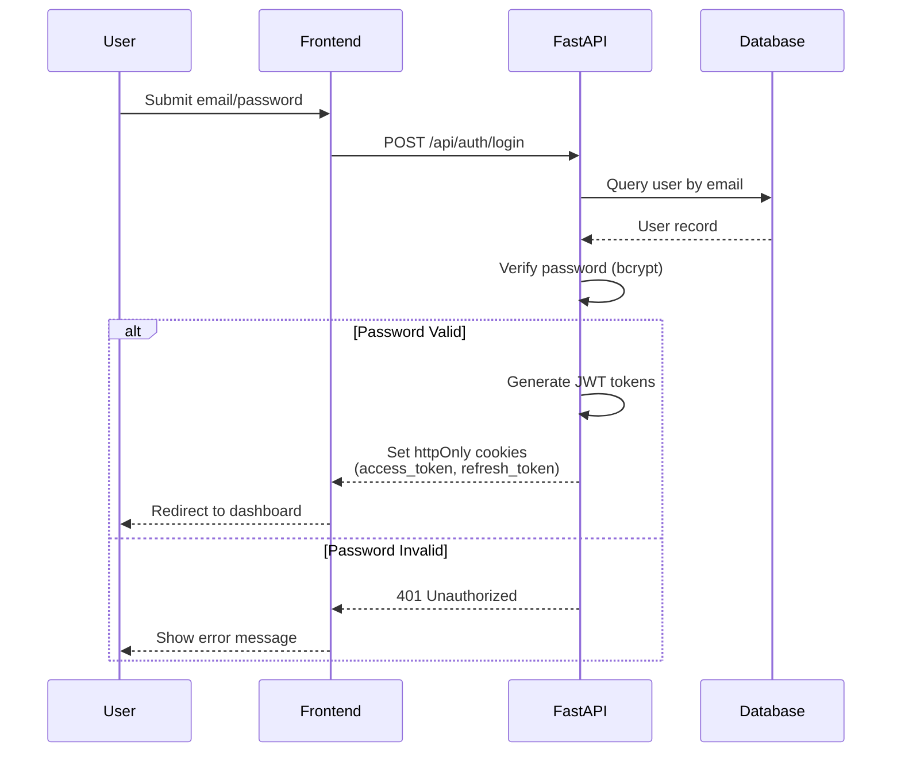
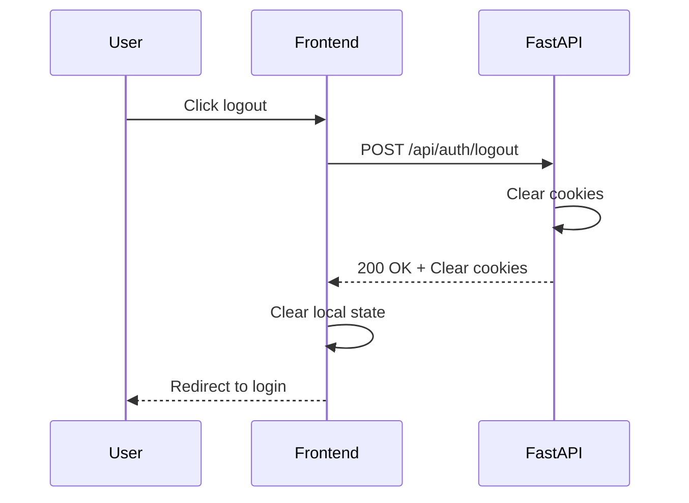
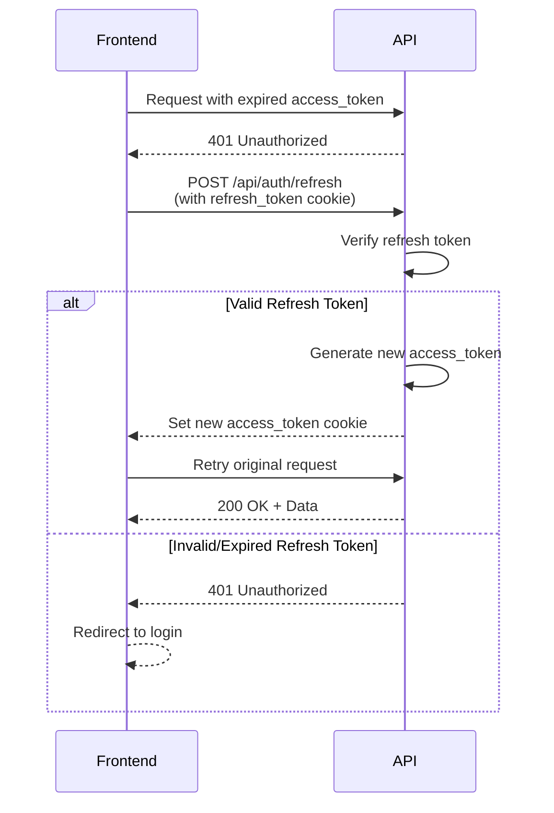

# AADA LMS - Authentication & Authorization

## Overview

The AADA LMS implements a secure authentication and authorization system using JWT tokens stored in httpOnly cookies. This approach was implemented in Phase 4 to enhance security by preventing JavaScript access to authentication tokens.

## Authentication Flow

### Login Process



### Token Management

**Access Token**:
- Short-lived (default: 15-30 minutes)
- Used for API authorization
- Stored in httpOnly cookie
- Cannot be accessed by JavaScript

**Refresh Token**:
- Longer-lived (default: 7-30 days)
- Used to obtain new access tokens
- Stored in separate httpOnly cookie
- Rotated on each refresh

### Cookie Configuration

```python
# Set in FastAPI response
response.set_cookie(
    key="access_token",
    value=access_token,
    httponly=True,       # Prevents JavaScript access
    secure=True,         # HTTPS only (production)
    samesite="lax",      # CSRF protection
    max_age=access_expire_seconds
)
```

### Logout Process



## Authorization

### Role-Based Access Control (RBAC)

**Roles**:
1. **Student** - Basic access to own data
2. **Instructor** - Course management, student grading
3. **Admin** - Full system access

**Role Assignment**:
- Stored in `users.role` column (enum: student, instructor, admin)
- Encoded in JWT token payload
- Verified on each protected endpoint

### Permission Matrix

| Resource | Student | Instructor | Admin |
|----------|---------|------------|-------|
| Own profile | Read/Write | Read/Write | Read/Write |
| Other profiles | None | Read (enrolled) | Full |
| Enrollments | Read (own) | Read (course) | Full |
| Courses | Read (enrolled) | Read/Write (assigned) | Full |
| Programs | Read | Read | Full |
| Transcripts | Read (own) | None | Full |
| Attendance | Read (own) | Write (course) | Full |
| Externships | Write (own) | Read/Verify | Full |
| Finance | Read (own) | None | Full |
| Reports | None | Read (course) | Full |
| System Settings | None | None | Full |

### Protected Routes

**Frontend Route Guards**:

```typescript
// Admin Portal (admin_portal/src/App.jsx)
<Route path="/dashboard" element={
  <ProtectedRoute requiredRole="admin">
    <Dashboard />
  </ProtectedRoute>
} />
```

**Backend Route Protection**:

```python
# backend/app/routers/users.py
@router.get("/", response_model=List[UserResponse])
def list_users(
    db: Session = Depends(get_db),
    current_user: User = Depends(get_current_user)  # ← Auth required
):
    # Verify admin role
    if current_user.role != "admin":
        raise HTTPException(status_code=403, detail="Admin access required")
    return db.query(User).all()
```

### Dependency Injection

**Current User Resolution**:

```python
# backend/app/core/security.py
def get_current_user(
    token: str = Depends(oauth2_scheme),  # Extract from cookie
    db: Session = Depends(get_db)
) -> User:
    """Extract user from JWT token"""
    try:
        payload = jwt.decode(token, SECRET_KEY, algorithms=["HS256"])
        user_id = payload.get("sub")
        if not user_id:
            raise HTTPException(status_code=401)
        
        user = db.query(User).filter(User.id == user_id).first()
        if not user:
            raise HTTPException(status_code=401)
        
        return user
    except JWTError:
        raise HTTPException(status_code=401, detail="Invalid token")
```

## Security Best Practices

### Password Security

**Hashing**:
- Algorithm: bcrypt
- Work factor: 12 rounds (configurable)
- Salted automatically by bcrypt

```python
from passlib.context import CryptContext

pwd_context = CryptContext(schemes=["bcrypt"], deprecated="auto")

# Hash password
hashed = pwd_context.hash(plain_password)

# Verify password
is_valid = pwd_context.verify(plain_password, hashed_password)
```

**Password Requirements**:
- Minimum 8 characters
- Mix of uppercase, lowercase, numbers, special chars
- Enforced at frontend and backend

### Token Security

**JWT Configuration**:
```python
SECRET_KEY = os.getenv("SECRET_KEY")  # Strong random key
ALGORITHM = "HS256"
ACCESS_TOKEN_EXPIRE_MINUTES = 30
REFRESH_TOKEN_EXPIRE_DAYS = 7
```

**Token Payload**:
```json
{
  "sub": "user_id",
  "role": "student",
  "email": "alice@aada.edu",
  "exp": 1234567890,
  "iat": 1234567800
}
```

### CORS Configuration

```python
# backend/app/main.py
app.add_middleware(
    CORSMiddleware,
    allow_origins=[
        "http://localhost:5173",  # Admin portal
        "http://localhost:5174",  # Student portal
    ],
    allow_credentials=True,  # Required for cookies
    allow_methods=["*"],
    allow_headers=["*"],
)
```

**Production CORS**:
- Restrict to production domain only
- No wildcards
- HTTPS required

### CSRF Protection

**Cookie SameSite Attribute**:
- Development: `lax` (allows some cross-origin)
- Production: `strict` (recommended)

**Additional Protection**:
- Double-submit cookie pattern (future)
- CSRF tokens for state-changing operations (future)

## Session Management

### Token Refresh Flow



### Auto-Refresh Implementation

**Frontend (Axios Interceptor)**:
```javascript
// admin_portal/src/services/api.js
axios.interceptors.response.use(
  (response) => response,
  async (error) => {
    if (error.response?.status === 401) {
      // Try to refresh token
      try {
        await axios.post('/api/auth/refresh');
        // Retry original request
        return axios(error.config);
      } catch (refreshError) {
        // Redirect to login
        window.location.href = '/login';
      }
    }
    return Promise.reject(error);
  }
);
```

### Session Timeout

**Access Token Expiry**: 30 minutes (configurable)
**Refresh Token Expiry**: 7 days (configurable)
**Inactive Session**: Refresh token expires, requires re-login

## Multi-Portal Authentication

### Separate Portals, Shared Backend

**Admin Portal** (`:5173`):
- Requires `admin` or `instructor` role
- Role checked on login and each request
- Separate cookie domain (development only)

**Student Portal** (`:5174`):
- Accepts `student` role
- Can also accept `instructor`/`admin` (for testing)
- Separate cookie domain (development only)

**Shared Backend** (`:8000`):
- Single authentication service
- Role-based endpoint protection
- Cookies set for respective portal domain

### Production Considerations

**Domain-Based Separation**:
- Admin: `admin.aada.edu`
- Student: `learn.aada.edu`
- API: `api.aada.edu`

**Cookie Scoping**:
- Admin cookies only valid for admin subdomain
- Student cookies only valid for student subdomain
- Prevents cookie sharing between portals

## Error Handling

### Authentication Errors

| Error Code | Scenario | Action |
|------------|----------|--------|
| 401 | Invalid credentials | Show error, allow retry |
| 401 | Expired access token | Auto-refresh, retry request |
| 401 | Expired refresh token | Redirect to login |
| 403 | Insufficient permissions | Show access denied message |
| 403 | Wrong portal for role | Redirect to correct portal |

### Frontend Error Handling

```typescript
// Student portal example
const { mutate: login } = useLoginMutation({
  onSuccess: () => {
    // Verify role
    const user = authStore.getState().user;
    if (user?.role === 'admin' || user?.role === 'instructor') {
      // Wrong portal
      setError('Please use the admin portal');
      return;
    }
    // Success - redirect
    navigate('/dashboard');
  },
  onError: (error) => {
    setError('Invalid email or password');
  }
});
```

## Audit & Logging

### Authentication Events

**Logged Events**:
- Login attempts (success/failure)
- Token refresh events
- Logout events
- Permission denied errors
- Suspicious activity (multiple failed logins)

**Log Format**:
```json
{
  "timestamp": "2025-11-04T12:34:56Z",
  "event": "login_success",
  "user_id": 123,
  "email": "alice@aada.edu",
  "ip_address": "192.168.1.1",
  "user_agent": "Mozilla/5.0..."
}
```

### FERPA Compliance

**Access Logging**:
- Who accessed which student records
- Timestamp of access
- Purpose of access (if applicable)

**Data Export Logging**:
- Report generation
- Transcript downloads
- Bulk data exports

## Testing Authentication

### E2E Tests

**Login Tests** (`e2e-tests/student-portal.spec.ts`):
```typescript
test('should login with valid credentials', async ({ page }) => {
  await page.goto('http://localhost:5174/login');
  await page.getByLabel('Email').fill('alice.student@aada.edu');
  await page.getByLabel('Password').fill('AlicePass!23');
  await page.getByRole('button', { name: /sign in/i }).click();
  
  // Verify redirect
  await page.waitForURL('**/dashboard');
  
  // Verify cookies set
  const cookies = await page.context().cookies();
  expect(cookies.some(c => c.name === 'access_token')).toBeTruthy();
  expect(cookies.some(c => c.name === 'refresh_token')).toBeTruthy();
});
```

**Authorization Tests**:
```typescript
test('should reject invalid credentials', async ({ page }) => {
  await page.goto('http://localhost:5174/login');
  await page.getByLabel('Email').fill('alice@aada.edu');
  await page.getByLabel('Password').fill('WrongPassword');
  await page.getByRole('button', { name: /sign in/i }).click();
  
  // Should remain on login page
  expect(page.url()).toContain('/login');
});
```

### Unit Tests

**Backend Tests** (pytest):
```python
def test_login_success(client, db_session):
    """Test successful login"""
    response = client.post('/api/auth/login', json={
        'email': 'alice@aada.edu',
        'password': 'AlicePass!23'
    })
    assert response.status_code == 200
    assert 'access_token' in response.cookies
    assert 'refresh_token' in response.cookies

def test_login_invalid_password(client):
    """Test login with wrong password"""
    response = client.post('/api/auth/login', json={
        'email': 'alice@aada.edu',
        'password': 'WrongPassword'
    })
    assert response.status_code == 401
```

## Security Checklist

### Development
- [ ] Passwords hashed with bcrypt
- [ ] JWT tokens in httpOnly cookies
- [ ] CORS configured for localhost
- [ ] Environment variables for secrets
- [ ] Role-based route protection
- [ ] Auto-refresh token mechanism

### Production
- [ ] HTTPS enforced (secure cookies)
- [ ] CORS restricted to production domain
- [ ] SameSite=strict cookies
- [ ] Strong SECRET_KEY (256-bit random)
- [ ] Token expiry tuned for security/UX balance
- [ ] Rate limiting on login endpoint
- [ ] Account lockout after failed attempts
- [ ] Audit logging enabled
- [ ] Regular security updates
- [ ] Penetration testing completed

## Future Enhancements

1. **Multi-Factor Authentication (MFA)**
   - TOTP (Google Authenticator, Authy)
   - SMS verification (optional)
   - Email verification codes

2. **OAuth2/SAML Integration**
   - Single Sign-On (SSO) for institutions
   - Google/Microsoft authentication

3. **Advanced Session Management**
   - Active session tracking
   - Device management
   - Force logout from all devices

4. **Enhanced Audit Logging**
   - Immutable audit trail
   - Compliance reporting dashboard
   - Anomaly detection

5. **Passwordless Authentication**
   - Magic links via email
   - WebAuthn/FIDO2 support

---

**Last Updated**: 2025-11-04  
**Maintained By**: Security Team
