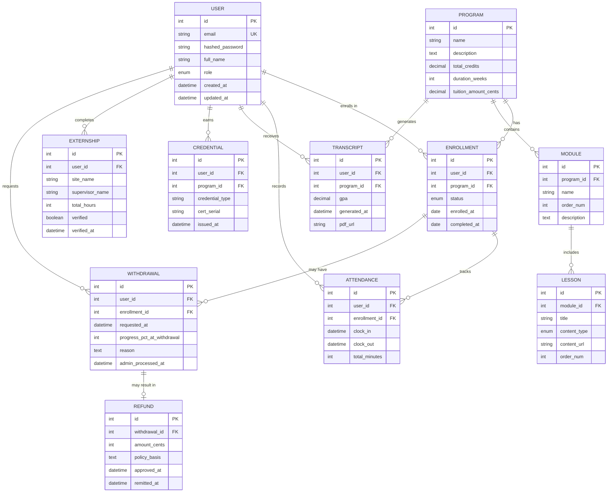

# AADA LMS - Database Documentation

## Overview

The AADA LMS uses PostgreSQL 17 as its primary data store. The database schema is managed through SQLAlchemy ORM and Alembic migrations.

## Database Architecture

### Connection Details

**Development**:
- Host: `db` (Docker service) or `localhost`
- Port: `5432`
- Database: `aada_lms`
- User: `postgres` (configurable via `.env`)

**Connection String**:
```
postgresql://postgres:postgres@db:5432/aada_lms
```

### Schema Overview

The database follows a normalized relational design with the following major entity groups:

1. **User Management** - Users, roles, authentication
2. **Academic Structure** - Programs, modules, lessons
3. **Enrollment** - Student program enrollments
4. **Compliance** - Attendance, transcripts, credentials, externships
5. **Finance** - Withdrawals, refunds
6. **Content Tracking** - SCORM, xAPI statements

## Entity-Relationship Diagram



## Table Definitions

### Core Tables

#### users

**Purpose**: User accounts for students, instructors, and administrators.

| Column | Type | Constraints | Description |
|--------|------|-------------|-------------|
| id | INTEGER | PRIMARY KEY | Auto-incrementing user ID |
| email | VARCHAR(255) | UNIQUE, NOT NULL | User email (login identifier) |
| hashed_password | VARCHAR(255) | NOT NULL | Bcrypt hashed password |
| full_name | VARCHAR(255) | NOT NULL | Full legal name |
| role | ENUM | NOT NULL | student, instructor, admin |
| created_at | TIMESTAMP | DEFAULT NOW() | Account creation timestamp |
| updated_at | TIMESTAMP | DEFAULT NOW() | Last update timestamp |
| deleted_at | TIMESTAMP | NULL | Soft delete timestamp |

**Indexes**:
- `idx_users_email` on `email` (unique)
- `idx_users_role` on `role`

**SQLAlchemy Model** (`backend/app/db/models/user.py`):
```python
class User(Base):
    __tablename__ = "users"
    
    id = Column(Integer, primary_key=True, index=True)
    email = Column(String(255), unique=True, nullable=False, index=True)
    hashed_password = Column(String(255), nullable=False)
    full_name = Column(String(255), nullable=False)
    role = Column(Enum("student", "instructor", "admin", name="user_role"), nullable=False)
    created_at = Column(DateTime, server_default=func.now())
    updated_at = Column(DateTime, server_default=func.now(), onupdate=func.now())
    deleted_at = Column(DateTime, nullable=True)
    
    # Relationships
    enrollments = relationship("Enrollment", back_populates="user")
    credentials = relationship("Credential", back_populates="user")
```

#### programs

**Purpose**: Degree or certificate programs offered by AADA.

| Column | Type | Constraints | Description |
|--------|------|-------------|-------------|
| id | INTEGER | PRIMARY KEY | Program ID |
| name | VARCHAR(255) | NOT NULL | Program name |
| description | TEXT | | Program description |
| total_credits | DECIMAL(5,2) | | Total credit hours |
| duration_weeks | INTEGER | | Expected completion time |
| tuition_amount_cents | INTEGER | | Tuition cost in cents |
| created_at | TIMESTAMP | DEFAULT NOW() | |
| updated_at | TIMESTAMP | DEFAULT NOW() | |

**Example Data**:
```sql
INSERT INTO programs (name, description, total_credits, duration_weeks, tuition_amount_cents)
VALUES (
  'Dental Assistant Professional',
  'Comprehensive dental assistant training program...',
  60.00,
  52,
  1200000  -- $12,000
);
```

#### modules

**Purpose**: Course modules within programs.

| Column | Type | Constraints | Description |
|--------|------|-------------|-------------|
| id | INTEGER | PRIMARY KEY | Module ID |
| program_id | INTEGER | FK programs(id) | Parent program |
| name | VARCHAR(255) | NOT NULL | Module name |
| order_num | INTEGER | NOT NULL | Display order |
| description | TEXT | | Module description |
| created_at | TIMESTAMP | DEFAULT NOW() | |

**Indexes**:
- `idx_modules_program_id` on `program_id`

#### lessons

**Purpose**: Individual lessons within modules.

| Column | Type | Constraints | Description |
|--------|------|-------------|-------------|
| id | INTEGER | PRIMARY KEY | Lesson ID |
| module_id | INTEGER | FK modules(id) | Parent module |
| title | VARCHAR(255) | NOT NULL | Lesson title |
| content_type | ENUM | NOT NULL | h5p, scorm, video, document |
| content_url | VARCHAR(512) | | URL to content |
| order_num | INTEGER | NOT NULL | Display order |
| created_at | TIMESTAMP | DEFAULT NOW() | |

### Enrollment Tables

#### enrollments

**Purpose**: Student enrollment in programs.

| Column | Type | Constraints | Description |
|--------|------|-------------|-------------|
| id | INTEGER | PRIMARY KEY | Enrollment ID |
| user_id | INTEGER | FK users(id) | Student |
| program_id | INTEGER | FK programs(id) | Program |
| status | ENUM | NOT NULL | active, completed, withdrawn |
| enrolled_at | DATE | NOT NULL | Enrollment date |
| completed_at | DATE | NULL | Completion date |
| progress_pct | INTEGER | DEFAULT 0 | Completion percentage |
| created_at | TIMESTAMP | DEFAULT NOW() | |

**Indexes**:
- `idx_enrollments_user_id` on `user_id`
- `idx_enrollments_program_id` on `program_id`
- `idx_enrollments_status` on `status`

### Compliance Tables

#### attendance

**Purpose**: Track student attendance/engagement hours.

| Column | Type | Constraints | Description |
|--------|------|-------------|-------------|
| id | INTEGER | PRIMARY KEY | Attendance record ID |
| user_id | INTEGER | FK users(id) | Student |
| enrollment_id | INTEGER | FK enrollments(id) | Related enrollment |
| clock_in | TIMESTAMP | NOT NULL | Session start |
| clock_out | TIMESTAMP | NULL | Session end |
| total_minutes | INTEGER | COMPUTED | Duration in minutes |
| notes | TEXT | | Optional notes |
| created_at | TIMESTAMP | DEFAULT NOW() | |

**Indexes**:
- `idx_attendance_user_id` on `user_id`
- `idx_attendance_enrollment_id` on `enrollment_id`

**Compliance**: Required for state reporting (GNPEC).

#### transcripts

**Purpose**: Official academic transcripts.

| Column | Type | Constraints | Description |
|--------|------|-------------|-------------|
| id | INTEGER | PRIMARY KEY | Transcript ID |
| user_id | INTEGER | FK users(id) | Student |
| program_id | INTEGER | FK programs(id) | Program |
| gpa | DECIMAL(3,2) | | Grade point average |
| total_credits | DECIMAL(5,2) | | Credits earned |
| generated_at | TIMESTAMP | NOT NULL | Generation timestamp |
| pdf_url | VARCHAR(512) | | URL to PDF file |
| created_at | TIMESTAMP | DEFAULT NOW() | |

**Retention**: Permanent (FERPA requirement).

#### credentials

**Purpose**: Certifications and credentials earned.

| Column | Type | Constraints | Description |
|--------|------|-------------|-------------|
| id | INTEGER | PRIMARY KEY | Credential ID |
| user_id | INTEGER | FK users(id) | Student |
| program_id | INTEGER | FK programs(id) | Program |
| credential_type | VARCHAR(255) | NOT NULL | Certificate type |
| cert_serial | VARCHAR(100) | | Certificate serial number |
| issued_at | DATE | | Issue date |
| created_at | TIMESTAMP | DEFAULT NOW() | |

**Example Data**:
```sql
INSERT INTO credentials (user_id, program_id, credential_type, cert_serial, issued_at)
VALUES (1, 1, 'Dental Assistant Certification', 'DAC-2024-001', '2024-05-15');
```

#### externships

**Purpose**: Clinical externship placements.

| Column | Type | Constraints | Description |
|--------|------|-------------|-------------|
| id | INTEGER | PRIMARY KEY | Externship ID |
| user_id | INTEGER | FK users(id) | Student |
| site_name | VARCHAR(255) | NOT NULL | Placement site |
| site_address | TEXT | | Site address |
| supervisor_name | VARCHAR(255) | | Supervisor name |
| supervisor_email | VARCHAR(255) | | Supervisor contact |
| total_hours | INTEGER | DEFAULT 0 | Hours completed |
| verified | BOOLEAN | DEFAULT FALSE | Admin verified |
| verified_at | TIMESTAMP | NULL | Verification timestamp |
| verification_doc_url | VARCHAR(512) | | Supporting document URL |
| created_at | TIMESTAMP | DEFAULT NOW() | |

**Indexes**:
- `idx_externships_user_id` on `user_id`
- `idx_externships_verified` on `verified`

### Financial Tables

#### withdrawals

**Purpose**: Student withdrawal requests.

| Column | Type | Constraints | Description |
|--------|------|-------------|-------------|
| id | INTEGER | PRIMARY KEY | Withdrawal ID |
| user_id | INTEGER | FK users(id) | Student |
| enrollment_id | INTEGER | FK enrollments(id) | Enrollment |
| requested_at | TIMESTAMP | NOT NULL | Request timestamp |
| progress_pct_at_withdrawal | INTEGER | | Course completion % |
| reason | TEXT | | Withdrawal reason |
| admin_notes | TEXT | | Administrative notes |
| admin_processed_at | TIMESTAMP | NULL | Processing timestamp |
| created_at | TIMESTAMP | DEFAULT NOW() | |

**Indexes**:
- `idx_withdrawals_user_id` on `user_id`
- `idx_withdrawals_enrollment_id` on `enrollment_id`

#### refunds

**Purpose**: Refund processing per GNPEC policy.

| Column | Type | Constraints | Description |
|--------|------|-------------|-------------|
| id | INTEGER | PRIMARY KEY | Refund ID |
| withdrawal_id | INTEGER | FK withdrawals(id) | Related withdrawal |
| amount_cents | INTEGER | NOT NULL | Refund amount (cents) |
| policy_basis | TEXT | | Policy justification |
| approved_at | TIMESTAMP | NULL | Approval timestamp |
| approved_by | INTEGER | FK users(id) | Approving admin |
| remitted_at | TIMESTAMP | NULL | Payment timestamp |
| created_at | TIMESTAMP | DEFAULT NOW() | |

**Indexes**:
- `idx_refunds_withdrawal_id` on `withdrawal_id`

### Content Tracking Tables

#### scorm_data

**Purpose**: SCORM package tracking.

| Column | Type | Constraints | Description |
|--------|------|-------------|-------------|
| id | INTEGER | PRIMARY KEY | SCORM data ID |
| user_id | INTEGER | FK users(id) | Student |
| lesson_id | INTEGER | FK lessons(id) | SCORM lesson |
| cmi_core_lesson_status | VARCHAR(50) | | Status (completed, incomplete) |
| cmi_core_score_raw | INTEGER | | Raw score |
| cmi_core_score_max | INTEGER | | Max score |
| cmi_suspend_data | TEXT | | Suspend data (JSON) |
| updated_at | TIMESTAMP | DEFAULT NOW() | Last update |

#### xapi_statements

**Purpose**: xAPI (Tin Can API) learning statements.

| Column | Type | Constraints | Description |
|--------|------|-------------|-------------|
| id | INTEGER | PRIMARY KEY | Statement ID |
| user_id | INTEGER | FK users(id) | Actor |
| verb | VARCHAR(100) | NOT NULL | Verb (completed, attempted) |
| object_id | VARCHAR(255) | NOT NULL | Object identifier |
| result | JSONB | | Result data |
| context | JSONB | | Context data |
| timestamp | TIMESTAMP | NOT NULL | Event timestamp |
| created_at | TIMESTAMP | DEFAULT NOW() | |

**Indexes**:
- `idx_xapi_user_id` on `user_id`
- `idx_xapi_timestamp` on `timestamp`

## Database Migrations

### Alembic Setup

**Configuration** (`backend/alembic.ini`):
```ini
[alembic]
script_location = alembic
sqlalchemy.url = postgresql://postgres:postgres@db:5432/aada_lms
```

**Environment** (`backend/alembic/env.py`):
```python
from app.db.base import Base
from app.db.models import *  # Import all models

target_metadata = Base.metadata
```

### Migration Workflow

**Create migration**:
```bash
cd backend
alembic revision --autogenerate -m "Add credentials table"
```

**Review generated migration** (`alembic/versions/xxxx_add_credentials_table.py`):
```python
def upgrade():
    op.create_table(
        'credentials',
        sa.Column('id', sa.Integer(), nullable=False),
        sa.Column('user_id', sa.Integer(), nullable=False),
        sa.Column('credential_type', sa.String(255), nullable=False),
        # ...
        sa.ForeignKeyConstraint(['user_id'], ['users.id']),
        sa.PrimaryKeyConstraint('id')
    )

def downgrade():
    op.drop_table('credentials')
```

**Apply migration**:
```bash
alembic upgrade head
```

**Rollback migration**:
```bash
alembic downgrade -1  # Rollback one migration
```

### Migration History

```
0001_init.py - Initial schema (users, programs, modules, lessons, enrollments)
0002_compliance.py - Compliance tables (attendance, transcripts, credentials, externships)
0003_auth_roles.py - Updated user roles and authentication fields
0004_finance.py - Financial tables (withdrawals, refunds)
0005_content_tracking.py - SCORM and xAPI tables
```

## Querying the Database

### Common Queries

**List all active enrollments**:
```sql
SELECT u.full_name, p.name AS program_name, e.enrolled_at
FROM enrollments e
JOIN users u ON e.user_id = u.id
JOIN programs p ON e.program_id = p.id
WHERE e.status = 'active'
ORDER BY e.enrolled_at DESC;
```

**Calculate total attendance hours per student**:
```sql
SELECT u.full_name, SUM(a.total_minutes) / 60.0 AS total_hours
FROM attendance a
JOIN users u ON a.user_id = u.id
GROUP BY u.id, u.full_name
ORDER BY total_hours DESC;
```

**List pending withdrawals**:
```sql
SELECT u.full_name, p.name AS program, w.requested_at, w.reason
FROM withdrawals w
JOIN users u ON w.user_id = u.id
JOIN enrollments e ON w.enrollment_id = e.id
JOIN programs p ON e.program_id = p.id
WHERE w.admin_processed_at IS NULL
ORDER BY w.requested_at ASC;
```

**Find students eligible for graduation** (completed all requirements):
```sql
SELECT u.full_name, p.name AS program
FROM enrollments e
JOIN users u ON e.user_id = u.id
JOIN programs p ON e.program_id = p.id
WHERE e.progress_pct >= 100
  AND e.status = 'active'
  AND NOT EXISTS (
    SELECT 1 FROM transcripts t 
    WHERE t.user_id = e.user_id AND t.program_id = e.program_id
  );
```

### SQLAlchemy Query Examples

**Fetch user with enrollments**:
```python
from app.db.models import User, Enrollment

user = db.query(User).filter(User.email == "alice@aada.edu").first()
enrollments = user.enrollments  # Uses relationship
```

**Complex query with joins**:
```python
from sqlalchemy import func

# Students with most attendance hours
top_students = (
    db.query(
        User.full_name,
        func.sum(Attendance.total_minutes).label("total_minutes")
    )
    .join(Attendance)
    .group_by(User.id)
    .order_by(func.sum(Attendance.total_minutes).desc())
    .limit(10)
    .all()
)
```

## Data Integrity

### Foreign Key Constraints

All foreign keys are enforced at the database level:
```sql
ALTER TABLE enrollments
ADD CONSTRAINT fk_enrollments_user_id
FOREIGN KEY (user_id) REFERENCES users(id) ON DELETE CASCADE;
```

**Cascade Behavior**:
- User deletion cascades to enrollments, attendance, etc.
- Program deletion restricted if enrollments exist
- Soft deletes used for users (set `deleted_at`, don't hard delete)

### Check Constraints

**Progress percentage**:
```sql
ALTER TABLE enrollments
ADD CONSTRAINT check_progress_pct
CHECK (progress_pct >= 0 AND progress_pct <= 100);
```

**GPA range**:
```sql
ALTER TABLE transcripts
ADD CONSTRAINT check_gpa
CHECK (gpa >= 0.0 AND gpa <= 4.0);
```

## Backup & Recovery

### Backup Strategy

**Automated backups** (Production):
- Daily full backups
- Hourly incremental backups
- 30-day retention
- Geographic redundancy

**Manual backup**:
```bash
# Backup database
docker-compose exec db pg_dump -U postgres aada_lms > backup_$(date +%Y%m%d).sql

# Backup with compression
docker-compose exec db pg_dump -U postgres aada_lms | gzip > backup_$(date +%Y%m%d).sql.gz
```

**Restore from backup**:
```bash
# Restore from SQL file
docker-compose exec -T db psql -U postgres -d aada_lms < backup_20251104.sql

# Restore from compressed backup
gunzip < backup_20251104.sql.gz | docker-compose exec -T db psql -U postgres -d aada_lms
```

### Point-in-Time Recovery

**PostgreSQL PITR** (Production):
- Continuous archiving of WAL files
- Restore to any point in time
- Configured via `postgresql.conf`

## Performance Optimization

### Indexes

**Existing indexes**:
- All primary keys (automatic)
- Foreign keys (automatic in PostgreSQL 17)
- `users.email` (unique index for login)
- `enrollments.user_id`, `enrollments.program_id` (common joins)

**Future indexes** (as needed):
```sql
-- Attendance queries by date range
CREATE INDEX idx_attendance_clock_in ON attendance (clock_in);

-- xAPI statement queries
CREATE INDEX idx_xapi_timestamp ON xapi_statements (timestamp DESC);

-- Partial index for active enrollments
CREATE INDEX idx_active_enrollments ON enrollments (user_id) WHERE status = 'active';
```

### Query Optimization

**Enable query logging** (development):
```python
# backend/app/db/session.py
engine = create_engine(DATABASE_URL, echo=True)  # Logs all SQL
```

**Analyze slow queries**:
```sql
EXPLAIN ANALYZE
SELECT ... FROM ... WHERE ...;
```

### Connection Pooling

**SQLAlchemy pool settings**:
```python
engine = create_engine(
    DATABASE_URL,
    pool_size=10,           # Number of connections to keep open
    max_overflow=20,        # Max additional connections
    pool_pre_ping=True,     # Verify connection before use
    pool_recycle=3600       # Recycle connections after 1 hour
)
```

## Security

### Password Storage

**Never store plaintext passwords**:
```python
from passlib.context import CryptContext
pwd_context = CryptContext(schemes=["bcrypt"], deprecated="auto")

# Hash password
hashed = pwd_context.hash(plain_password)

# Store hashed_password in database
user.hashed_password = hashed
```

### SQL Injection Prevention

**Always use parameterized queries**:
```python
# Good (SQLAlchemy ORM)
user = db.query(User).filter(User.email == email).first()

# Also good (raw SQL with parameters)
result = db.execute(text("SELECT * FROM users WHERE email = :email"), {"email": email})

# NEVER do this (vulnerable to SQL injection)
result = db.execute(f"SELECT * FROM users WHERE email = '{email}'")
```

### Access Control

**Database-level access control**:
```sql
-- Application user (limited privileges)
CREATE USER aada_app WITH PASSWORD 'strong_password';
GRANT SELECT, INSERT, UPDATE, DELETE ON ALL TABLES IN SCHEMA public TO aada_app;

-- No DROP, TRUNCATE, or schema modification allowed
```

## Monitoring

### Database Metrics

**Track in production**:
- Connection pool utilization
- Query execution time (slow query log)
- Table sizes and growth rate
- Index usage statistics
- Lock contention

**PostgreSQL stats**:
```sql
-- Table sizes
SELECT schemaname, tablename, pg_size_pretty(pg_total_relation_size(schemaname||'.'||tablename))
FROM pg_tables
WHERE schemaname = 'public'
ORDER BY pg_total_relation_size(schemaname||'.'||tablename) DESC;

-- Index usage
SELECT schemaname, tablename, indexname, idx_scan, idx_tup_read, idx_tup_fetch
FROM pg_stat_user_indexes
ORDER BY idx_scan DESC;

-- Active connections
SELECT count(*) FROM pg_stat_activity;
```

---

**Last Updated**: 2025-11-04  
**Maintained By**: Database Administrator
