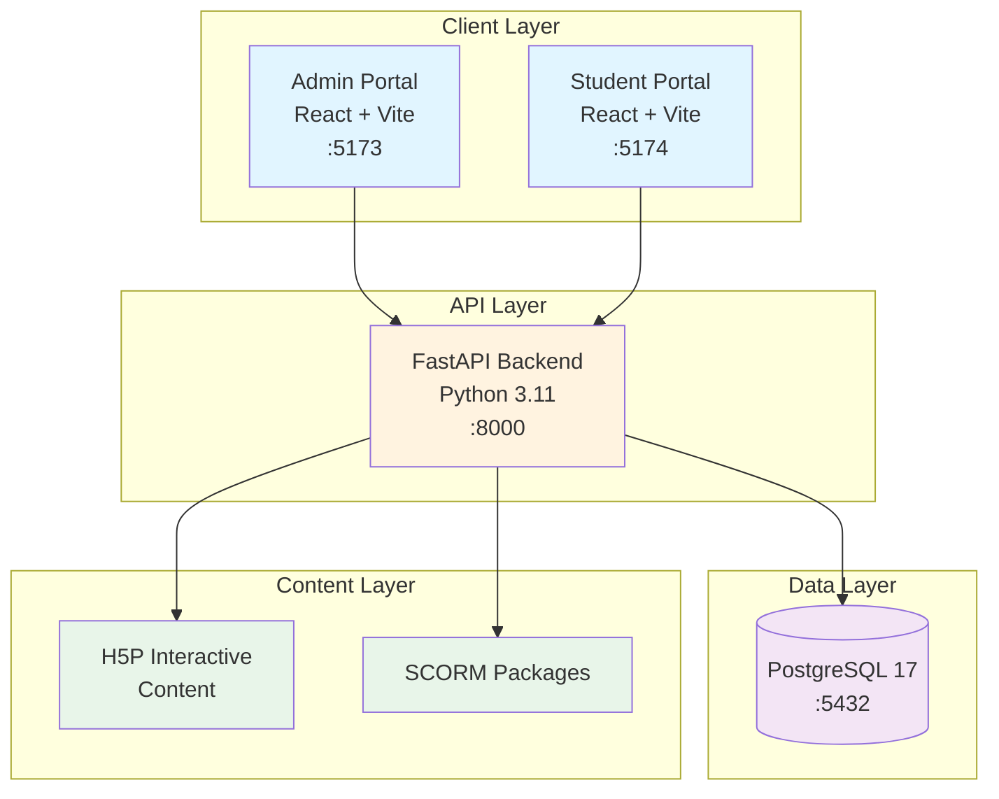
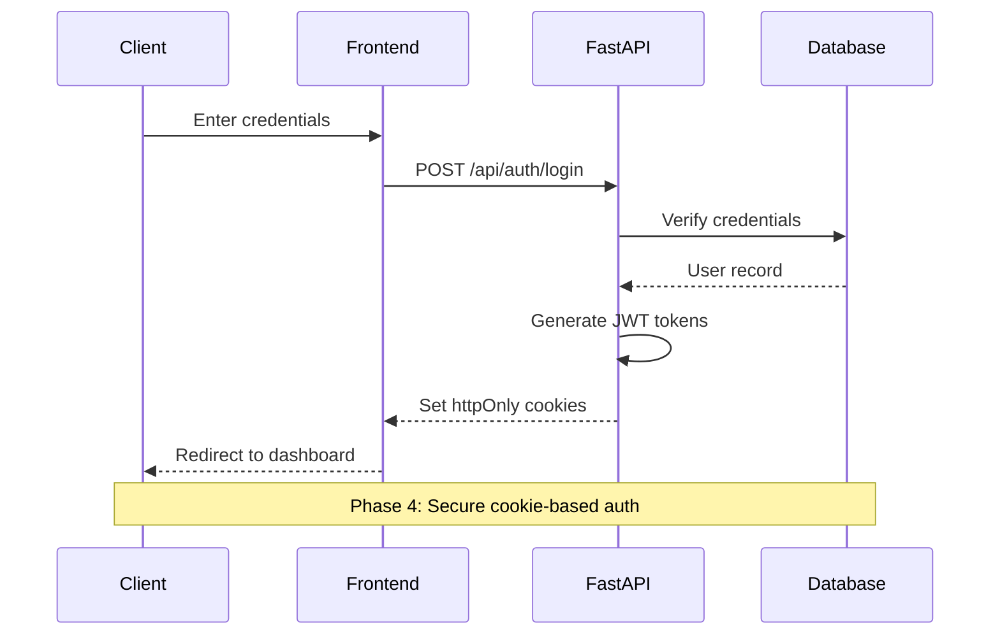
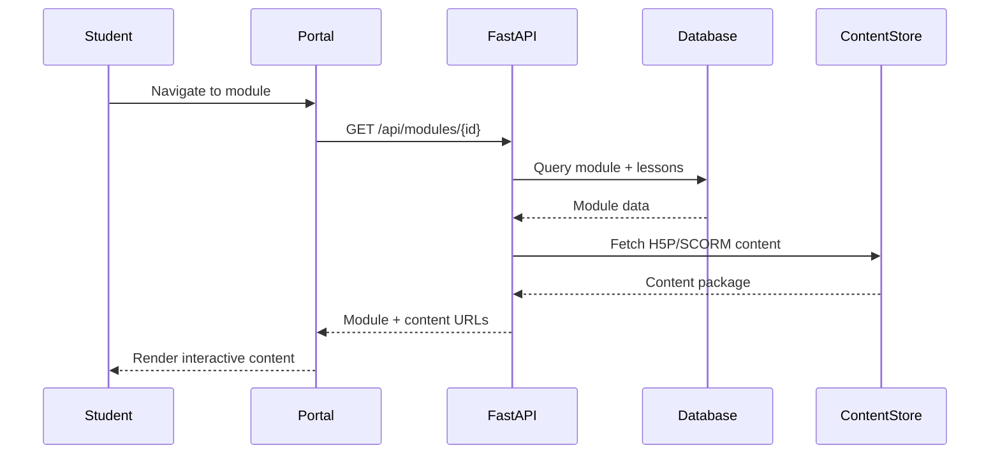

# AADA LMS - System Architecture

## Overview

The AADA Learning Management System is a full-stack web application designed for Allied American Dental Assistants to deliver online courses, manage student records, and maintain regulatory compliance with FERPA and PHI standards.

### Architecture Diagram



## Technology Stack

### Frontend
- **Framework**: React 18
- **Build Tool**: Vite 5
- **UI Library**: Material-UI v6 (MUI)
- **Language**: TypeScript
- **State Management**: Zustand (auth), TanStack Query (server state)
- **Routing**: React Router v6
- **HTTP Client**: Axios
- **Testing**: Playwright (E2E)

### Backend
- **Framework**: FastAPI
- **Language**: Python 3.11
- **ORM**: SQLAlchemy 2.0
- **Authentication**: JWT with httpOnly cookies
- **Database Migrations**: Alembic
- **Testing**: pytest
- **Documentation**: OpenAPI/Swagger (auto-generated)

### Database
- **DBMS**: PostgreSQL 17
- **Pooling**: SQLAlchemy connection pooling
- **Migrations**: Alembic version control

### Infrastructure
- **Containerization**: Docker + Docker Compose
- **Reverse Proxy**: (Planned) Nginx
- **Process Manager**: (Planned) Gunicorn/Uvicorn workers

## Service Architecture

### Docker Compose Services

```yaml
services:
  db:          # PostgreSQL 17 on :5432
  backend:     # FastAPI on :8000
  admin:       # Admin Portal on :5173
  student:     # Student Portal on :5174
```

All services communicate via Docker internal network. Frontend proxies API requests to backend service.

## Data Flow

### Authentication Flow



### Content Delivery Flow



## Component Responsibilities

### Admin Portal (`/admin_portal`)

**Purpose**: Administrative interface for staff and instructors

**Key Features**:
- Student management (enrollment, progress tracking)
- Program/course administration
- Compliance reporting (FERPA, attendance)
- Externship verification
- Payment/refund processing
- xAPI/SCORM analytics

**Tech Stack**:
- React 18 + Material-UI v6
- Vite dev server on :5173
- API client: Axios with auth interceptors

### Student Portal (`/frontend/aada_web`)

**Purpose**: Student-facing interface for course access

**Key Features**:
- Course module navigation
- Interactive H5P content
- Progress tracking
- Document uploads (credentials)
- Externship hour logging
- Payment history

**Tech Stack**:
- React 18 + TypeScript + Material-UI v6
- Vite dev server on :5174
- TanStack Query for server state
- Zustand for auth state

### Backend API (`/backend`)

**Purpose**: RESTful API and business logic layer

**Key Endpoints**:
- `/api/auth/*` - Authentication & authorization
- `/api/users/*` - User management
- `/api/programs/*` - Program/course data
- `/api/enrollments/*` - Student enrollments
- `/api/modules/*` - Course content
- `/api/externships/*` - Externship tracking
- `/api/finance/*` - Payments/refunds
- `/api/credentials/*` - Document management
- `/api/xapi/*` - Learning analytics
- `/api/scorm/*` - SCORM content delivery

**Database Models**:
- User (with role-based access)
- Program, Module, Lesson
- Enrollment
- Attendance, Transcript
- Externship, Credential
- Withdrawal, Refund
- xAPI statements, SCORM tracking

### Database (`PostgreSQL`)

**Schema Highlights**:
- User management with role-based access
- Program/module/lesson hierarchy
- Compliance tables (attendance, transcripts, externships)
- Financial records (withdrawals, refunds)
- Content tracking (xAPI, SCORM)

**Connection**:
- Accessed via SQLAlchemy ORM
- Connection string: `DATABASE_URL` environment variable
- Pooling enabled with `pool_pre_ping=True`

## Security Architecture

### Authentication (Phase 4)

- **Method**: JWT tokens stored in httpOnly cookies
- **Token Types**: 
  - Access token (short-lived)
  - Refresh token (longer-lived)
- **Storage**: Cookies with Secure, HttpOnly, SameSite flags
- **Flow**: Login → Set cookies → Auto-refresh → Logout clears cookies

### Authorization

- **Role-Based Access Control (RBAC)**:
  - `admin` - Full system access
  - `instructor` - Course management, grading
  - `student` - Course access, own records only

### Data Protection

- **FERPA Compliance**: Student records restricted by role
- **PHI Considerations**: Health information handling (externships)
- **Password Security**: Bcrypt hashing
- **HTTPS**: Required in production (enforced by cookies)

## Deployment Architecture

### Current (Development)

```
Docker Compose
├── PostgreSQL :5432
├── FastAPI :8000
├── Admin Portal :5173 (Vite dev server)
└── Student Portal :5174 (Vite dev server)
```

### Planned (Production)

```
Load Balancer (AWS ALB/Nginx)
├── Static Frontend (S3 + CloudFront / Nginx)
├── API Gateway/Nginx → FastAPI (Gunicorn workers)
└── RDS PostgreSQL (AWS RDS / Managed PostgreSQL)
```

**Additional Production Considerations**:
- Environment-based configuration (dev/staging/prod)
- Secrets management (AWS Secrets Manager / HashiCorp Vault)
- Logging & monitoring (CloudWatch / ELK stack)
- Backup & disaster recovery
- CDN for static assets and H5P content

## File Structure

```
aada_lms/
├── admin_portal/          # Admin React app
│   ├── src/
│   │   ├── components/
│   │   ├── pages/
│   │   └── services/
│   └── package.json
│
├── frontend/aada_web/     # Student React app
│   ├── src/
│   │   ├── api/          # Generated API clients
│   │   ├── features/     # Feature-based modules
│   │   ├── components/
│   │   └── stores/
│   └── package.json
│
├── backend/               # FastAPI application
│   ├── app/
│   │   ├── routers/      # API endpoints
│   │   ├── db/
│   │   │   ├── models/   # SQLAlchemy models
│   │   │   └── session.py
│   │   ├── core/         # Config, security
│   │   └── main.py
│   ├── alembic/          # Database migrations
│   └── requirements.txt
│
├── e2e-tests/            # Playwright tests
├── docs/                 # Project documentation
├── docker-compose.yml
└── README.md
```

## Configuration Management

### Environment Variables

**Backend**:
- `DATABASE_URL` - PostgreSQL connection string
- `SECRET_KEY` - JWT signing key
- `ALLOWED_ORIGINS` - CORS origins
- `POSTGRES_*` - Database credentials

**Frontend**:
- `VITE_API_URL` - Backend API base URL
- Build-time injection via Vite

### Docker Compose

- Uses `.env` file for environment variables
- Volume mounts for development hot-reload
- Internal network for service communication
- Port mapping for external access

## API Communication

### Frontend → Backend

1. **Admin Portal**:
   - Uses Axios with base URL `http://localhost:8000`
   - Auth interceptor attaches credentials
   - Handles token refresh automatically

2. **Student Portal**:
   - Uses TanStack Query with generated API client
   - OpenAPI-generated TypeScript types
   - Cookie-based auth (httpOnly)

### Backend → Database

- SQLAlchemy ORM with async support (future)
- Connection pooling for performance
- Alembic migrations for schema changes

## Content Delivery

### H5P Content
- Stored in `/backend/app/static/modules/`
- Served via FastAPI static file mounting
- Frontend embeds via iframe or direct integration

### SCORM Packages
- Future implementation planned
- xAPI tracking for learning analytics
- Compliance with SCORM 1.2/2004 standards

## Testing Strategy

### E2E Tests (Playwright)
- `/e2e-tests/admin-portal.spec.ts`
- `/e2e-tests/student-portal.spec.ts`
- Tests authentication, page loads, API integration
- Run against live Docker Compose stack

### Backend Tests (pytest)
- Unit tests for business logic
- Integration tests for database operations
- API endpoint testing

### Frontend Tests
- (Planned) Vitest for unit tests
- (Planned) React Testing Library for components

## Performance Considerations

- **Frontend**: Code splitting, lazy loading routes
- **Backend**: Connection pooling, query optimization
- **Database**: Indexes on frequently queried columns
- **Content**: CDN for static assets (production)

## Scalability

### Current Limitations
- Single FastAPI instance
- Single PostgreSQL instance
- Development servers (Vite)

### Future Scaling
- Horizontal scaling of FastAPI workers (Gunicorn)
- Database read replicas
- Content delivery via CDN
- Load balancing across multiple API instances

## Monitoring & Observability

### Planned
- Application logs (structured JSON)
- Health check endpoints
- Performance metrics (response time, throughput)
- Error tracking (Sentry or similar)
- Database query performance monitoring

---

**Last Updated**: 2025-11-04  
**Maintained By**: Development Team
