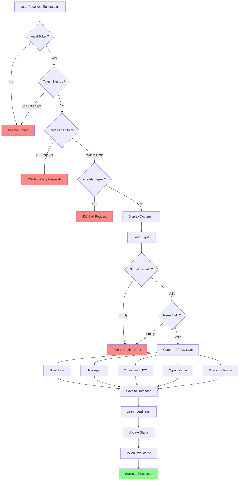
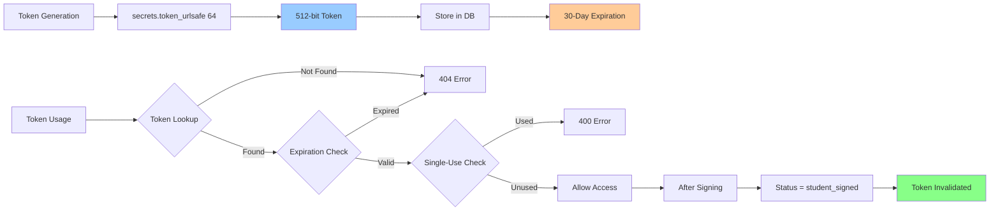
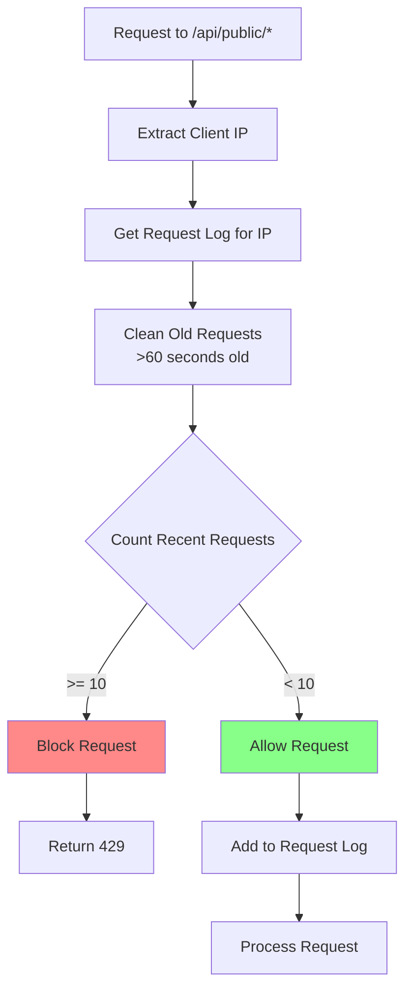
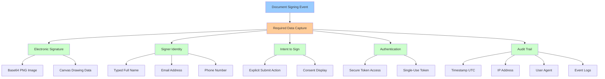
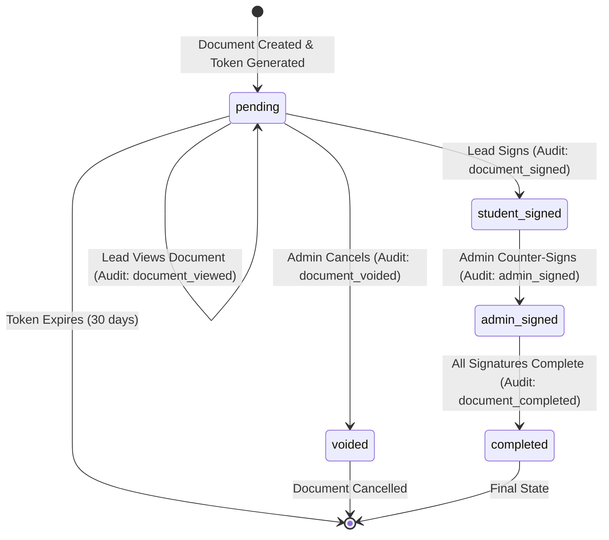
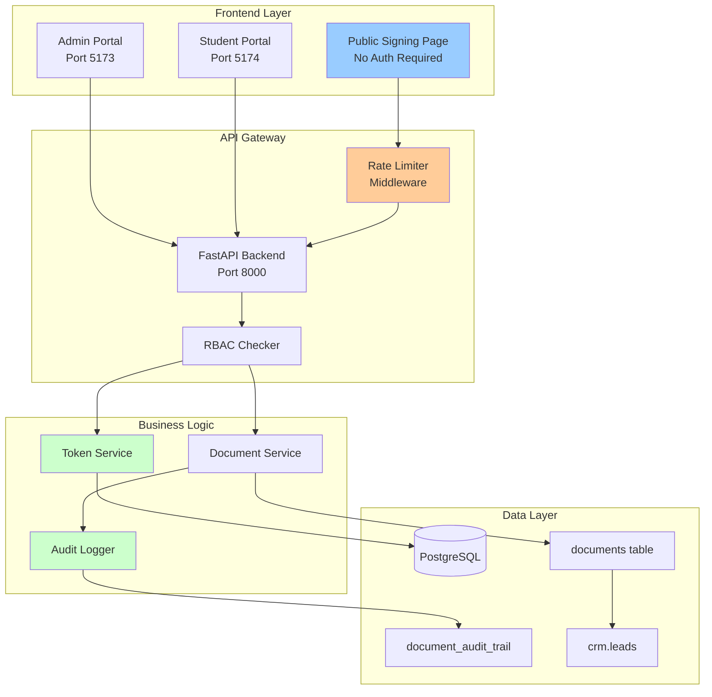

# AADA LMS - E-Sign Flow Diagram

## Complete Document Signing Workflow

```mermaid
sequenceDiagram
    actor Admin as Admin/Staff
    participant Portal as Admin Portal<br/>(React)
    participant Backend as FastAPI Backend
    participant DB as PostgreSQL
    participant RateLimit as Rate Limiter
    actor Lead as Lead/Prospect
    participant PublicPage as Public Signing Page<br/>(React - No Auth)

    Note over Admin,PublicPage: Phase 1: Lead Creation & Document Preparation

    Admin->>Portal: Login with credentials
    Portal->>Backend: POST /api/auth/login
    Backend->>DB: Validate credentials
    DB-->>Backend: User + Roles
    Backend-->>Portal: JWT tokens (cookies)

    Admin->>Portal: Navigate to Leads page
    Admin->>Portal: Click "Create Lead"
    Portal->>Backend: POST /api/crm/leads
    Backend->>DB: INSERT INTO crm.leads
    DB-->>Backend: Lead created (ID)
    Backend-->>Portal: Lead object
    Portal-->>Admin: Lead created successfully

    Note over Admin,PublicPage: Phase 2: Document Sending

    Admin->>Portal: Select lead → "Send Document"
    Portal->>Backend: GET /api/documents/templates?active_only=true
    Backend->>DB: SELECT FROM document_templates WHERE is_active=true
    DB-->>Backend: Active templates
    Backend-->>Portal: List of templates

    Admin->>Portal: Select template → "Generate Signing Link"
    Portal->>Backend: POST /api/documents/send<br/>{template_id, lead_id}

    Backend->>Backend: Generate 512-bit crypto token<br/>secrets.token_urlsafe(64)
    Backend->>Backend: Set expiration (30 days)
    Backend->>DB: INSERT INTO documents<br/>(token, lead_id, expires_at, status='pending')
    Backend->>DB: INSERT INTO document_audit_trail<br/>(event='document_sent')
    DB-->>Backend: Document ID, Token
    Backend-->>Portal: {document_id, signing_token}

    Portal->>Portal: Generate public URL<br/>http://localhost:5174/sign/{token}
    Portal-->>Admin: Display signing link + Copy button

    Admin->>Admin: Copy link to clipboard
    Admin->>Lead: Send link via Email/SMS<br/>(external to system)

    Note over Admin,PublicPage: Phase 3: Lead Accesses Signing Page (Public - No Auth)

    Lead->>PublicPage: Click signing link<br/>GET /sign/{token}
    PublicPage->>PublicPage: Extract token from URL

    PublicPage->>RateLimit: Check rate limit
    RateLimit->>RateLimit: Count requests from IP<br/>(10 per 60 seconds)

    alt Rate limit exceeded
        RateLimit-->>PublicPage: 429 Too Many Requests
        PublicPage-->>Lead: Error: Too many requests
    else Within rate limit
        RateLimit->>Backend: Allow request
        PublicPage->>Backend: GET /api/public/sign/{token}

        Backend->>DB: SELECT FROM documents<br/>WHERE signing_token={token}

        alt Token not found or expired
            DB-->>Backend: No document found
            Backend-->>PublicPage: 404 Not Found
            PublicPage-->>Lead: Error: Invalid or expired link
        else Token valid
            DB-->>Backend: Document details
            Backend->>Backend: Check if already signed

            alt Already signed
                Backend-->>PublicPage: 400 Bad Request<br/>"Already signed"
                PublicPage-->>Lead: Error: Document already signed
            else Not signed yet
                Backend->>DB: INSERT INTO document_audit_trail<br/>(event='document_viewed')
                Backend-->>PublicPage: {signer_name, signer_email,<br/>template_name, content}
                PublicPage-->>Lead: Display document + signature canvas
            end
        end
    end

    Note over Admin,PublicPage: Phase 4: Lead Signs Document

    Lead->>PublicPage: Read document content
    Lead->>PublicPage: Draw signature on canvas
    Lead->>PublicPage: Type full name
    Lead->>PublicPage: Click "Submit Signature"

    PublicPage->>PublicPage: Validate signature data exists
    PublicPage->>PublicPage: Validate typed name not empty
    PublicPage->>PublicPage: Convert signature to base64 PNG

    PublicPage->>RateLimit: Check rate limit
    alt Rate limit exceeded
        RateLimit-->>PublicPage: 429 Too Many Requests
        PublicPage-->>Lead: Error: Too many requests
    else Within rate limit
        RateLimit->>Backend: Allow request
        PublicPage->>Backend: POST /api/public/sign/{token}<br/>{signature_data, typed_name}

        Backend->>Backend: Capture IP address
        Backend->>Backend: Capture User-Agent
        Backend->>Backend: Generate timestamp (UTC)

        Backend->>DB: BEGIN TRANSACTION
        Backend->>DB: UPDATE documents SET<br/>status='student_signed',<br/>student_signed_at=NOW(),<br/>student_signature_data={base64},<br/>student_ip_address={ip},<br/>student_user_agent={ua}
        Backend->>DB: INSERT INTO document_audit_trail<br/>(event='document_signed',<br/>event_data={typed_name, ip, ua})
        Backend->>DB: COMMIT TRANSACTION

        DB-->>Backend: Document updated
        Backend-->>PublicPage: {success: true}
        PublicPage-->>Lead: ✅ Success: Document signed!<br/>Thank you message
    end

    Note over Admin,PublicPage: Phase 5: Verification & Audit

    Admin->>Portal: Navigate to Leads page
    Admin->>Portal: View lead details
    Portal->>Backend: GET /api/documents?lead_id={id}
    Backend->>DB: SELECT FROM documents WHERE lead_id={id}
    DB-->>Backend: Document list with status
    Backend-->>Portal: Documents (including signed status)
    Portal-->>Admin: Display document status: "Signed ✓"

    Admin->>Portal: View audit trail
    Portal->>Backend: GET /api/documents/{doc_id}/audit-trail
    Backend->>DB: SELECT FROM document_audit_trail<br/>WHERE document_id={doc_id}
    DB-->>Backend: Audit logs
    Backend-->>Portal: {logs: [{event, timestamp, ip, ua}]}
    Portal-->>Admin: Display complete audit trail:<br/>- document_sent<br/>- document_viewed<br/>- document_signed
```



## Security Measures Flow



## Token Security Architecture



## Rate Limiting Flow



## ESIGN Act Compliance Data



## Document Status Lifecycle



## System Components



## Key Features

### Security
- 512-bit cryptographically secure tokens
- 30-day token expiration
- Single-use tokens (invalidated after signing)
- Rate limiting: 10 requests per 60 seconds per IP
- IP address and user agent tracking
- No authentication required for signing (token-based)

### ESIGN Act Compliance
- Electronic signature capture (base64 PNG)
- Typed name confirmation
- Timestamp (UTC)
- IP address logging
- User agent logging
- Complete audit trail
- Intent to sign documented

### Audit Trail Events
1. `document_sent` - Admin sends document to lead
2. `document_viewed` - Lead accesses public signing page
3. `document_signed` - Lead submits signature
4. `token_expired` - Token reaches 30-day expiration
5. `document_voided` - Admin cancels document
6. `admin_signed` - Admin counter-signs (future)
7. `document_completed` - All signatures complete (future)

### Error Handling
- **404**: Invalid or expired token
- **400**: Already signed, validation errors
- **429**: Rate limit exceeded
- **500**: Server errors

### Token Generation
```python
import secrets
from datetime import datetime, timedelta

def generate_signing_token():
    """Generate cryptographically secure 512-bit token"""
    return secrets.token_urlsafe(64)

def create_token_expiration():
    """Create 30-day expiration timestamp"""
    return datetime.utcnow() + timedelta(days=30)
```

### Rate Limiting Algorithm
- **Window**: 60 seconds (sliding window)
- **Limit**: 10 requests per window per IP
- **Scope**: All `/api/public/*` endpoints
- **Storage**: In-memory (production: Redis recommended)
- **Cleanup**: Automatic removal of expired entries

---

**Document Version:** 3.0
**Last Updated:** December 1, 2024
**Related Documentation:** `aada_lms_sis_12012024.md`
